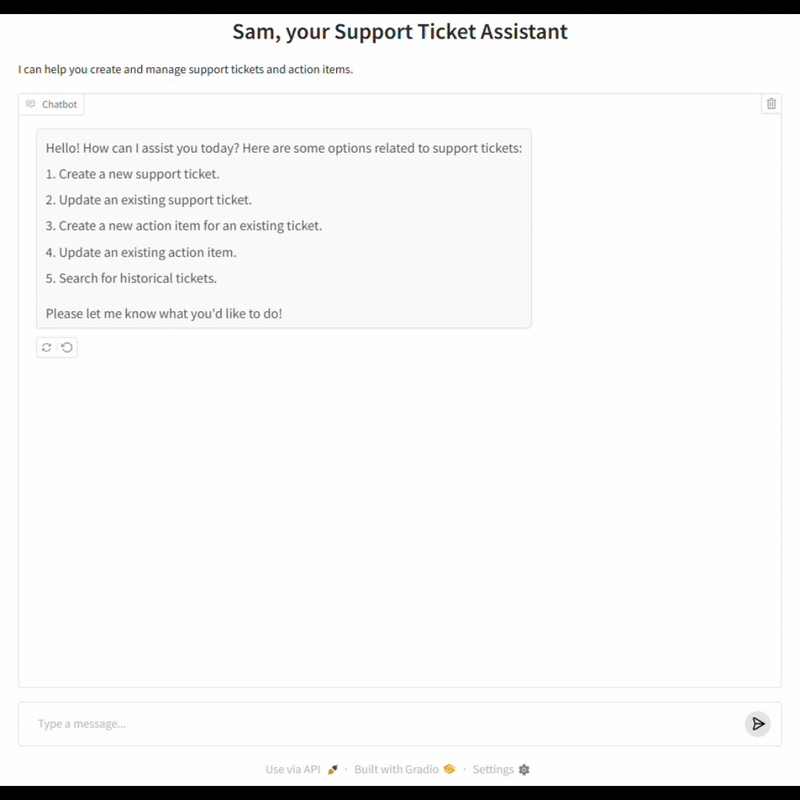
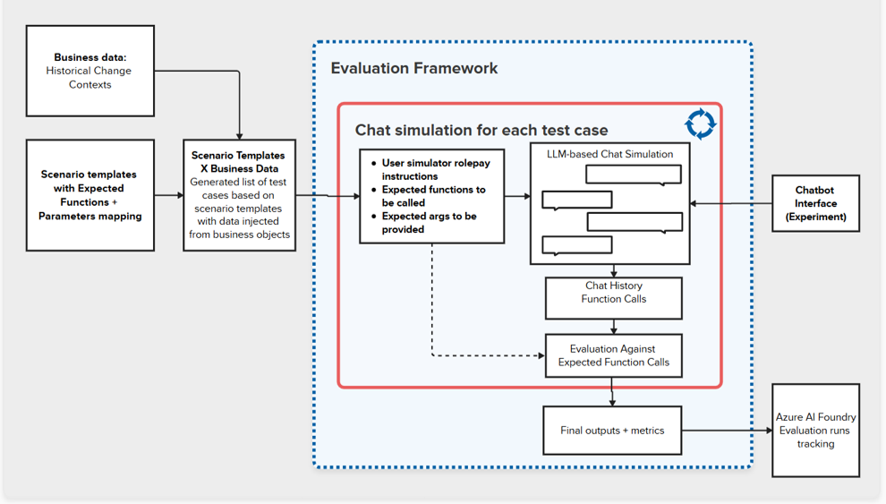
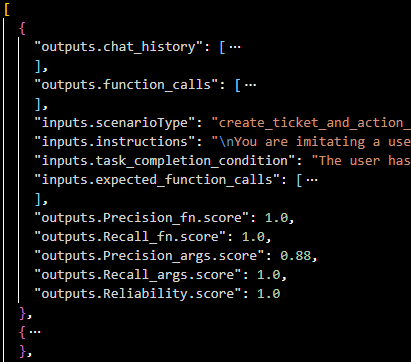
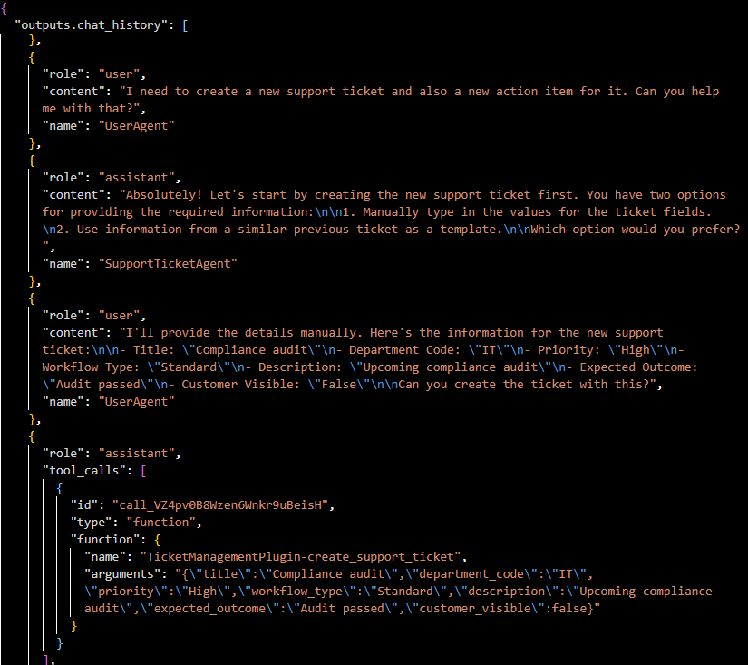
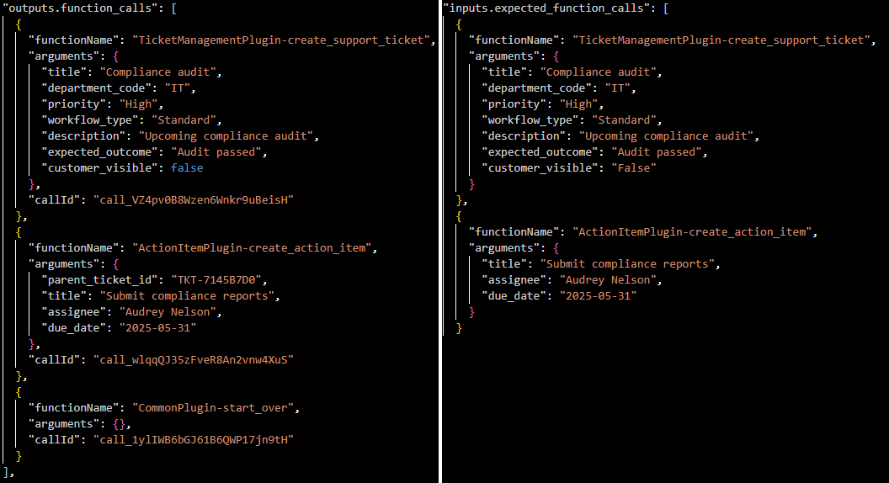
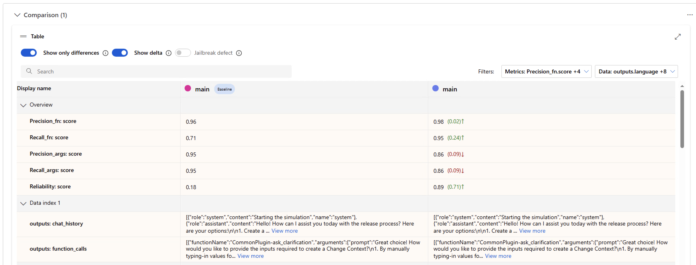

# Evaluating LLM-Powered Chatbots in Enterprise Workflows

## Introduction

The landscape of conversational AI has undergone a seismic shift with the emergence of large language models (LLMs). These sophisticated systems have transformed chatbots from rigid, rule-based interactions to dynamic, seemingly intelligent conversations. But with this transformation comes a fundamental challenge: how do we effectively measure the performance of these systems, especially in business-critical environments?



Traditional chatbot evaluation frameworks fall short when applied to modern LLM-based agents. Metrics that served deterministic, rule-based systems well—such as binary success/failure rates, strict accuracy measures, and fixed response matching—cannot adequately capture the nuanced performance of systems capable of handling ambiguity, maintaining context across multiple turns, and employing complex reasoning.

This evaluation gap creates significant challenges for enterprises deploying LLM-powered chatbots in business-critical scenarios. When a system can respond to the same query in multiple valid ways, or when the correct response depends on subtle contextual factors, evaluation frameworks must evolve beyond simplistic pass/fail paradigms to assess both functional correctness and conversational effectiveness.

This blog post will delve deeper into these evaluation challenges, exploring how traditional metrics fall short and proposing a comprehensive methodology for effective evaluation of LLM-powered LOB chatbots. We'll present a practical framework that balances the flexibility of natural language with the precision required for business operations, and demonstrate how you can easily adapt this approach to your specific scenarios using our reference implementation and GitHub Copilot. By the end, you'll have both the conceptual understanding and practical tools needed to confidently deploy and continuously improve your enterprise conversational AI solutions.

### The Open-Ended vs. Closed-Domain Evaluation Challenges

Evaluating conversational AI presents a spectrum of challenges that vary dramatically based on the task domain:

- **Open-ended task agents** (like those generating images, answering general knowledge questions, or providing creative content) operate in unbounded spaces where success criteria are often subjective. For these systems, evaluation typically focuses on user satisfaction, appropriateness, and creative quality.

- **Closed-domain, business-specific agents** — the Line of Business (LOB) chatbots that manage inventory, process orders, or handle employee requests— face a different reality. These systems interact with structured business processes and must deliver precise, reliable outcomes with minimal tolerance for error. Here, evaluation must balance the flexibility of natural language interaction with the rigor of business process execution.

*If you would like to better understand the role of "agents" in conversational AI, I encourage you to check out [building effective agents](https://www.anthropic.com/engineering/building-effective-agents) blog post by Anthropic.*

### The Non-Deterministic Evaluation Problem

LLM-based chatbots introduce a fundamental challenge to evaluation: non-determinism. Unlike rule-based systems that produce identical outputs for identical inputs, LLMs incorporate elements of randomness and contextual interpretation that can result in varied—yet equally valid—responses to the same query.

This non-determinism creates several evaluation hurdles:

- **Reproducibility issues:** Test cases may pass or fail inconsistently
- **Ground truth ambiguity:** Multiple response paths may be equally correct
- **Function calling reliability:** The same user intent might be mapped to different function calls on different runs
- **Hallucination risk:** Models may confidently present incorrect information or take inappropriate actions

### Why LOB Chatbots Demand Rigorous Evaluation

For general-purpose assistants, occasional errors might be acceptable. For business systems managing inventory, processing payments, or handling sensitive customer data, they are not. Several factors make evaluation especially critical for LOB chatbots:

1. **Business process integrity**: Errors can disrupt critical workflows
2. **Compliance requirements**: Many industries face strict regulatory oversight
3. **System integrations**: Chatbots must reliably interact with multiple backend systems
4. **Financial implications**: Mistakes can directly impact revenue and costs
5. **Employee and customer trust**: Consistent performance builds essential confidence

### Towards a Comprehensive Evaluation Framework

The gap between traditional metrics and the needs of modern LLM-based LOB applications demands a new evaluation paradigm. We need frameworks that can:

- Assess both deterministic (did it correctly call the right function?) and non-deterministic aspects (did it understand user intent?)
- Evaluate across multiple dimensions: task completion, conversation quality, and business impact
- Account for the complexity of multi-turn conversations and complex business processes
- Scale to enterprise needs while providing actionable insights for improvement

In the following sections, we'll share our journey building an end-to-end evaluation framework for LLM-powered LOB chatbots, the technical challenges we overcame, and the methodology we developed to ensure these powerful but complex systems deliver reliable business value.

## LOB Chatbot Evaluation Framework

Our team have recently worked with one of our customers on developing a LOB chatbot that was supposed to replace an internal, legacy tool for change management in their product development process. The tool was hard to maintain, had a very complex UI with a lot of business rules and restrictions, and it also required a lot of expert knowledge from users. Their leadership believed LLM-powered chatbots are the answer for these challenges and they wanted to build one with us. Our task was to prove feasibility and reliability of such solution when deployed at scale. That's where we started considering all of the forementioned challenges in evaluating such systems. Our primary goal was to run evaluations which would prove overall reliability and provide stakeholders with enough confidence in this solution. With that in mind we designed and implemented an evalution framework for LLM-powered, LOB chatbots.

TODO: Update evaluation framework diagram to make it super general. Add error analysis.



The above diagram illustrates the architecture of our evaluation framework, highlighting its key components and their interactions. We designed it to address the unique challenges of evaluating LOB chatbots, ensuring scalability, reproducibility, and actionable insights. We implemented this framework and shared it in a generalized way along with a demo LOB chatbot for a fake scenario of support tickets management. You can find it here: https://github.com/marcgs/lob-chatbot-sample

In the following sections we will break it down by key components and provide in-depth explanations based on real solution that we developed and tested.

### Chat Simulation

A key pillar of our evaluation framework is the ability to simulate realistic, multi-turn conversations between a user and the chatbot. To achieve this, we developed an LLM-powered User Agent that acts as a stand-in for real users, following scenario-specific instructions and interacting with the chatbot just as a human would.

In each evaluation run, the User Agent is provided with a set of instructions that define the user's intent and business context (for example, creating a high-priority support ticket for an IT issue). The User Agent then engages in a natural conversation with the chatbot, responding to prompts, clarifying details, and navigating the workflow as a real user would. This back-and-forth continues until a predefined completion condition is met, such as the successful creation of a ticket or resolution of a request.

To achieve this we created a template system prompt for the User Agent and during the generation of test cases dataset (covered in the next section) we inject it with business data and the specific task (user instructions) we expect the agent to complete during simulation.

```python
user_agent_system_prompt = """
You are imitating a user interacting with a chatbot assistant.

Your goal is to complete a specific task by conversing naturally with the assistant.

Behave like a non-technical user who understands the task, but not the internal workings of the system.

You have access to some business data relevant to your task. Use it when appropriate during the conversation.

Follow these rules:
- Act as a user, not an assitant.
- Never correct the assistant or point out mistakes.
- You are not allowed to change the inputs proposed by the assistant.
- Stay focused on the task but allow for slight variability in how you express yourself.
- Use the business data as needed, but do not mention that it was "given" to you.
- Do not modify the business data you are given.
- Speak naturally, as if you are recalling or referencing information you know.
- Once your task is completed, you must end the conversation by saying "the session is finished".
- Your goal is achieved when the assistant has completed the task and you have confirmed it.

Here is the business data you can use during the conversation:
{business_data}

Here is your task:
{user_instructions}

Begin the conversation. Respond as the user.
"""
```

To ensure realistic interactions, the User Agent is prompted to simulate non-technical users who understand the task but not the internal workings of the system. However, the simulation framework we've built is flexible enough to support creation of test cases which can take into account different user personalities and interaction styles. This approach helps identify potential usability issues and ensures the chatbot can handle diverse user expressions effectively. For example, in real-world scenarios, we may encounter power users who interact with the chatbot in a concise and efficient manner, as well as novice users whose interactions are less efficient and prone to mistakes. With our approach we can easily test it by providing additional instructions to the User Agent:

```json
...
"scenario_name": "cmd_create_ticket_and_action_item",
"user_instructions": "Create a new support ticket by manually providing the data and create a new action item for it. Don't use full sentences but only command-like terms 'search ...', 'new action ...', etc. If presented with a numerical list of options, use the number of the option to select it.",
...
```

```json
Conversation snippet:
{
  "role": "assistant",
  "content": "Hello! How can I assist you today? Here are your options:\n\n1. Create a new support ticket.  \n2. Update an existing support ticket.  \n3. Create a new action item for an existing ticket.  \n4. Update an existing action item.  \n5. Search for historical tickets.  \n\nPlease let me know how you'd like to proceed!",
  "name": "SupportTicketAgent"
},
{
  "role": "user",
  "content": "1",
  "name": "UserAgent"
},
{
  "role": "assistant",
  "content": "Great! You want to create a new support ticket. How would you like to proceed?\n\n1. Manually provide the required details for the support ticket.  \n2. Use information from a similar previous ticket as a template.  \n\nLet me know your preference!",
  "name": "SupportTicketAgent"
},
{
  "role": "user",
  "content": "1",
  "name": "UserAgent"
},
{
  "role": "assistant",
  "content": "Got it! Please provide the following details to create the support ticket:\n\n1. **Title**: A concise and descriptive
...
```

Our simulation logic is implemented using [Semantic Kernel](https://github.com/microsoft/semantic-kernel) but as you can see below, it mostly depends on a simple loop, so the same pattern could be easily reproduced with any framework or even without one. You can find our implementation in the [chat_simulator.py](https://github.com/marcgs/lob-chatbot-sample/blob/main/evaluation/chatbot/simulation/chat_simulator.py) module in our repository. Below is a simplified example of the simulation logic:

```python
    from semantic_kernel.contents import ChatHistory, ChatMessageContent
    from semantic_kernel.agents import (
        ChatCompletionAgent,
        ChatHistoryAgentThread,
        AgentResponseItem,
    )
    from semantic_kernel.agents.strategies import KernelFunctionTerminationStrategy

    # Create Support Ticket Agent (evaluation target)
    support_ticket_agent: ChatCompletionAgent = create_support_ticket_agent(name="SupportTicketAgent")

    # Create User Agent
    user_agent: ChatCompletionAgent = create_user_agent(name="UserAgent", instructions=instructions)

    # Termination Strategy to detect conversation end
    termination_strategy: KernelFunctionTerminationStrategy = (
        create_termination_strategy(
            task_completion_condition=task_completion_condition
        )
    )

    # Create agent conversation thread (includes function calls)
    agent_thread: ChatHistoryAgentThread = ChatHistoryAgentThread(
        thread_id="ChatSimulatorAgentThread"
    )

    # Create separate user thread for the user agent to keep track of conversation
    # from the user's perspective separately
    user_thread: ChatHistoryAgentThread = ChatHistoryAgentThread(
        thread_id="ChatSimulatorUserThread"
    )

    while True:
        # Support Ticket Agent conversation turn
        agent_message: AgentResponseItem[ChatMessageContent] = await support_ticket_agent.get_response(messages=user_message, thread=agent_thread)

        # User Agent conversation turn
        user_response = await user_agent.get_response(messages=agent_message.content, thread=user_thread)

        # ...
        
        history = await agent_thread.get_messages()

        # Check if conversation is finished according to the specified termination condition
        should_agent_terminate = await termination_strategy.should_agent_terminate(
            agent=support_ticket_agent,
            history=history,
        )

        if should_agent_terminate:
            # Conversation is finished => exit loop
            break

    # Extract history including function calls
    return history
```


### Ground Truth Generation at Scale

To gain meaningful confidence in LLM-powered chatbots within enterprise settings, we need to run evaluations at scale with significant numbers of test cases. This isn't about dozens of manually curated examples - we're talking about hundreds of test cases for each task or scenario to establish statistical significance. Moreover, these scenarios must closely resemble real-world usage patterns and be grounded in actual business data to provide valid performance indicators. To achieve this scale while maintaining relevance, we designed a pattern that combines scenario templates with real business data using a "test case factory" approach. This factory automatically injects real business data into parameterized scenario templates, allowing us to generate hundreds of diverse yet realistic test cases efficiently. By systematically varying inputs across multiple dimensions of the business domain, we can thoroughly stress-test the chatbot's understanding and function-calling capabilities under conditions that mirror production environments.

To generate evaluation datasets at scale, we leverage a script [generate_eval_dataset.py](https://github.com/marcgs/lob-chatbot-sample/blob/main/evaluation/chatbot/ground-truth/generate_eval_dataset.py) that combines scenario templates with real or representative business data. This script automates the creation of test cases by filling placeholders in templates with data from support tickets and action items. Below is a simplified example of a scenario template including placeholders that will be replaced with business data:

```json
{
    "scenario_name": "create_ticket_and_action_item",
    "user_instructions": "Create a new support ticket by manually providing the data and create a new action item for it.",
    "task_completion": "The user has confirmed the end of the session.",
    "expected_function_calls": [
      {
        "functionName": "TicketManagementPlugin-create_support_ticket",
        "arguments": {
          "title": "{ticket.title}",
          "department_code": "{ticket.department_code}",
          "priority": "{ticket.priority}",
          "workflow_type": "{ticket.workflow_type}",
          "description": "{ticket.description}",
          "expected_outcome": "{ticket.expected_outcome}",
          "customer_visible": "{ticket.customer_visible}"
        }
      },
      {
        "functionName": "ActionItemPlugin-create_action_item",
        "arguments": {
          "title": "{action.title}",
          "assignee": "{action.assignee}",
          "due_date": "{action.due_date}"
        }
      }
    ]
}
```

### Simulation Outputs

Throughout the simulated conversation, the framework automatically captures all exchanged messages and every function call made by the agent, including the function name and all arguments provided. This structured record of function calls is essential for evaluation: it allows us to directly compare the chatbot's actions against the expected function calls for each scenario, measuring not just whether the right functions were called, but also whether the correct parameters were supplied and the business process was followed as intended.

Simulation outputs:



Simulated conversation history:



Actual vs expected function calls - used to calculate various metrics and overall reliability score of the LOB agent:



### Evaluation, Metrics, and Error Analysis

With conversation history, actual and expected function call data in hand, we can use the framework to compute a suite of evaluation metrics, which include:

- **Function Call Name Precision and Recall**  
  Measures the accuracy of function calling, in terms of function names.  
  For recall we check how many of expected functions were correctly called by LOB agent, and for precision we measure if any unexpected functions were called during simulation (LLMs can halucinate or simply misspell function names).
- **Function Call Argument Precision and Recall**  
  Measures the accuracy of function calls in terms of function parameters.  
  For recall we check how many expected arguments were correctly provided, and for precision we check if any extra/unexpected arguments appeared during simulation (LLMs can halucinate or simply misspell function arguments).  
- **Reliability Score**  
  Measures overall success in completing test case tasks and should be used as the main metric for evaluation.  
  We calculate this score for each test case by using the mean of our primary metrics: recall of function names and recall of function arguments.  
  The final score is the mean of all test case level scores.

The evaluation framework integrates with the [Azure AI Evaluation SDK](https://learn.microsoft.com/python/api/overview/azure/ai-evaluation-readme) to calculate metrics and track evaluation runs. See [function_call_precision.py](https://github.com/marcgs/lob-chatbot-sample/blob/main/evaluation/chatbot/evaluators/function_call_precision.py), [function_call_recall.py](https://github.com/marcgs/lob-chatbot-sample/blob/main/evaluation/chatbot/evaluators/function_call_recall.py), and [function_call_reliability.py](https://github.com/marcgs/lob-chatbot-sample/blob/main/evaluation/chatbot/evaluators/function_call_reliability.py) modules for details on how these metrics have been implemented in the sample application.

One huge benefit of using Azure AI Evaluation SDK is that by adding single argument we enable an optional [Azure AI Foundry](https://learn.microsoft.com/azure/ai-foundry/) integration. This gives us a convenient dashboard for tracking evaluation runs, single place to store our metrics and make comparisons between different runs. It becomes especially important and useful with long running evaluations (hundreds or thousands of test cases which might take even several hours).



Aside from calculating metrics, a critical part of the evaluation process is performing error analysis. The insights gained from this step are essential for guiding further experimentation and focusing improvement efforts on the line-of-business (LOB) agents.

In our framework, for every evaluation run, we automatically copy the [error_analysis.ipynb](https://github.com/marcgs/lob-chatbot-sample/blob/main/evaluation/chatbot/error_analysis_chatbot.ipynb) notebook into the evaluation outputs directory and execute it there. This notebook processes the `evaluation_results.json` file and performs several key analyses. In addition to standard operations - such as breaking down metrics by test scenarios and identifying the most error-prone functions and arguments - we also leverage LLMs to review the full conversation history of each simulation. This allows us to generate higher-level insights and draw conclusions much faster than ever before. Using this approach significantly improves upon the previously manual and time-consuming task of combing through message exchanges, enabling faster, more structured, and actionable feedback which accelerates the overal process of experimentation.

```markdown
#### Emerging Patterns and Key Issues:
1. **Redundant Function Calls**:
   - Across multiple test cases, the chatbot made unnecessary calls to retrieve reference data (e.g., `ReferenceDataPlugin-get_departments`, `ReferenceDataPlugin-get_priority_levels`) or action item details (`ActionItemPlugin-get_action_item`), even when the required information was already provided by the user or cached.
   - This redundancy negatively impacted **Precision_fn** scores, even though the chatbot's logic was often valid for ensuring data accuracy.

2. **Session Reset Misinterpretation**:
   - The chatbot frequently invoked `CommonPlugin-start_over` when the user stated phrases like "The session is finished." This indicates a misunderstanding of user intent, where the chatbot interpreted session-ending statements as requests to reset the session.
   - This behavior disrupted workflows and introduced unnecessary function calls.

3. **Argument Mismatches**:
   - In several cases, the chatbot included additional arguments (e.g., `parent_ticket_id` in `ActionItemPlugin-create_action_item`, `ticket_id` in `update_support_ticket`) that were logically valid but not part of the expected function calls. This led to lower **Precision_args** scores despite the chatbot's arguments being accurate and complete.

4. **Misalignment Between Expected and Actual Behavior**:
   - Test cases often did not account for logical preparatory steps (e.g., fetching reference data, checking for existing action items) or additional arguments that were necessary for the chatbot's implementation. This misalignment penalized the chatbot's performance metrics, even when its behavior was user-centric and logical.

5. **Multi-Turn Interaction Handling**:
   - In some scenarios (e.g., `update_action_item_assignee`), the chatbot failed to transition smoothly from gathering user inputs to executing the required action. This resulted in incomplete workflows or unnecessary loops.

6. **High Recall but Low Precision**:
   - The chatbot consistently achieved high **Recall_fn** and **Recall_args** scores, indicating that all expected function calls and arguments were included. However, low **Precision_fn** and **Precision_args** scores highlighted the presence of extraneous calls and arguments.

```

### Bring Your Own Scenario

A powerful advantage of the LOB Chatbot sample is how easily it can be adapted to other business domains with [GitHub Copilot’s Agent Mode](https://code.visualstudio.com/docs/copilot/chat/chat-agent-mode) and a plan-driven approach. By leveraging Copilot’s ability to generate migration plans and guide code adaptation, teams can rapidly scaffold, customize, and evaluate LOB chatbots for any enterprise context.

This makes the sample an effective accelerator for demos, PoCs, and production projects: simply define your scenario, and let Copilot guide the migration and implementation process as you update the relevant plugins, data models, and evaluation templates. The approach enables you to focus on your unique business logic while reusing a robust, well-tested foundation.

For step-by-step instructions on adapting the solution to your use case, see the [README](https://github.com/marcgs/lob-chatbot-sample/blob/main/README.md#migrating-the-sample).

## Conclusions

```
TODO: Address Implementation Challenges and Mitigation Strategies
Add a section discussing common challenges in implementing this framework and how to address them:

- Balancing coverage vs. evaluation cost
- Dealing with LLM user agent limitations
- Handling edge cases and ambiguity
- Managing prompt engineering for both the user agent and chatbot
- Cost considerations for running evaluations at scale
- Parallelizing evaluations for large test suites
- Resource management and optimization
- Cost considerations and budgeting for evaluation
```

By combining realistic simulation, comprehensive data capture, and automated evaluation, this solution provides a scalable and repeatable methodology for assessing LOB chatbots in enterprise environments. The result is a robust foundation for continuous improvement and confident deployment of conversational AI in business-critical workflows.
