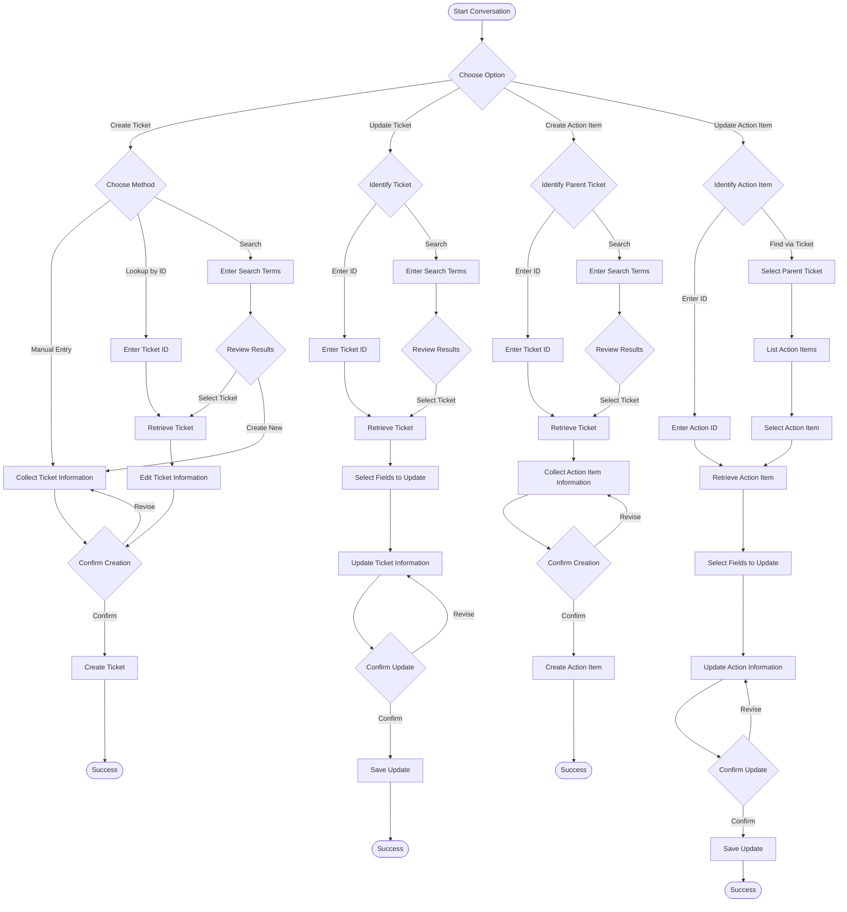
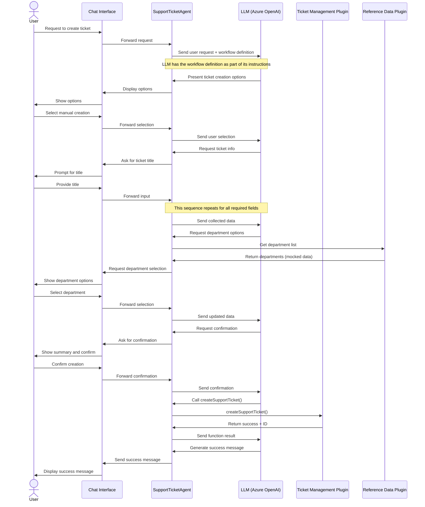
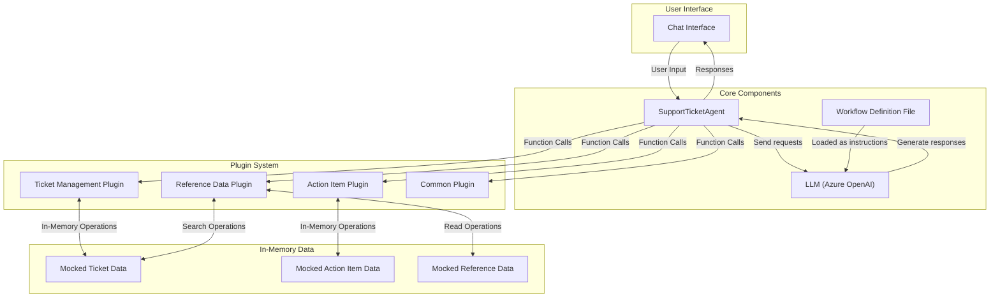

# Support Ticket Management System Workflow

This document provides a visual representation of the workflows implemented in the Support Ticket Management System, showing how users interact with the system and how data flows between components.

## Main Workflow Overview

The diagram below illustrates the primary workflow paths in the Support Ticket Management System:

## Component Interaction During Ticket Creation

The sequence diagram below shows how system components interact during ticket creation:

## Data Flow Between Components

The diagram below illustrates how data flows between system components. Note that this sample implementation uses in-memory data stores with mocked services for demonstration purposes. In a production environment, you would replace these with connections to actual enterprise systems:

These diagrams provide a visual representation of how the Support Ticket Management System works, showing both the user interaction flows and the internal component interactions.